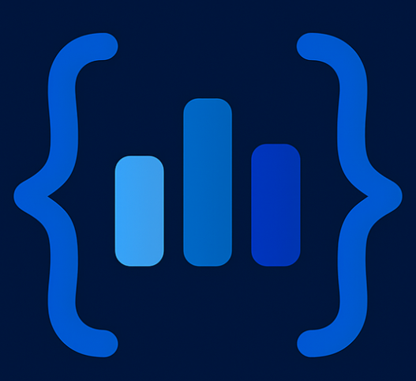

<div align="center">
  

  # 🚀 CodeTrack Frontend

  **Track your competitive programming journey with style and analytics**

  [](https://reactjs.org/)
  [](https://tailwindcss.com/)
  [](https://vitejs.dev/)
  [](LICENSE)

  [🌟 Live Demo](https://codetrack-rosy.vercel.app/) • [📖 Docs](#documentation) • [🐛 Report Bug](https://forms.gle/fvUhcbL7WSUY4UE37) • [💡 Request Feature](https://forms.gle/fvUhcbL7WSUY4UE37)
</div>

---

## ✨ Features

- **🏆 Personal Leaderboard**: Track your progress against friends and competitors
- **📊 Competitor Management**: Add and monitor Codeforces usernames
- **📚 CP Sheets**: Curated problem sets with difficulty progression (CP31 Sheet)
- **📅 Contest Tracking**: Stay updated with upcoming programming contests
- **👤 Profile Management**: Detailed user profiles with statistics and achievements
- **📈 Progress Analytics**: Charts and statistics using Recharts
- **🎨 Beautiful UI**: Modern dark theme with gradients and animations
- **📱 Responsive Design**: Optimized for all devices
- **⚡ Real-time Updates**: Live data from Codeforces API

---

## 🛠️ Tech Stack

| Frontend | Styling | Tools | APIs |
|----------|---------|-------|------|
| React    | Tailwind CSS | Vite | Codeforces API |
| JavaScript | CSS3 | ESLint | REST API |

**Key Dependencies:** React Router, Recharts, Lucide React, Axios

---

## 🚀 Quick Start

**Prerequisites:**  
- Node.js (v18+)
- npm or yarn
- Git

**Installation:**
```bash
git clone https://github.com/your-username/codetrack-frontend.git
cd codetrack-frontend
npm install
# or
yarn install
```

**Environment Variables:**
```bash
cp .env.example .env.local
```
Edit `.env.local`:
```env
VITE_API_BASE_URL=http://localhost:5000/api
VITE_CODEFORCES_API_URL=https://codeforces.com/api
```

**Start Development:**
```bash
npm run dev
# or
yarn dev
```
Open [http://localhost:5173](http://localhost:5173) in your browser.

**Build for Production:**
```bash
npm run build
npm run preview
```

---

## 📸 Screenshots

<div align="center">

**Dashboard**  


**Leaderboard**  


**CP Sheets**  


**Profile Management**  


</div>

---

## 🧩 Main Components

<<<<<<< HEAD
- `CodeTrackLogo`: Animated logo
- `ProfileCard`: User profile display
- `AchievementCard`: Achievement progress
- `UsernameAdder`: Add competitors with validation

**Main Pages:**
- `AuthPage`: Login/register
- `Dashboard`: Main app dashboard
- `UsernameManagement`: Competitor management
- `ProfilePage`: User profile & stats
- `CoursePage`: CP sheets & contests
- `UserDetailsPage`: Codeforces profile analysis

---

## 📊 Project Structure

=======
### Adding Competitors
```javascript

navigate(`/username-management/${email}`);

// Add a new competitor
const response = await add(userId, username.trim());
if (response.success) {
  setUsernames(prev => [...prev, response.user]);
}
>>>>>>> e495df67bbb23a09d88c664ccb7110c8c581ed25
```
src/
├── components/          # Reusable UI components
├── pages/               # Main application pages
│   └── cp_sheets/
├── utils/               # Utility functions
├── assets/              # Static assets
└── styles/              # Global styles
```

---

## 🔗 API Integration

- **Codeforces API**: `/api/user.info`, `/api/user.status`, `/api/contest.list`
- **Backend API**: `/api/auth/login`, `/api/auth/register`, `/api/user/add`, `/api/user/remove`, `/api/user/fetch`

---

## 🌐 Deployment

**Vercel:**  
- Connect repo, set build command: `npm run build`, output: `dist`
- Set environment variables in dashboard

**Other:**  
- Netlify: Deploy `dist` after `npm run build`
- GitHub Pages: Deploy `dist` to `gh-pages`
- Firebase Hosting: Use `firebase deploy`

---

## 🤝 Contributing

- Fork & PRs welcome!
- Report bugs or request features via [Google Form](https://forms.gle/fvUhcbL7WSUY4UE37)
- Follow ESLint config and React best practices

---

## 📞 Support & Community

- [Bug Reports](https://forms.gle/fvUhcbL7WSUY4UE37)
- [Feature Requests](https://forms.gle/fvUhcbL7WSUY4UE37)
- Email: support@codetrack.dev
- Discord: [Join our community](https://discord.gg/codetrack)

---

## 📄 License

MIT License. See [LICENSE](LICENSE).

---

<div align="center">

⭐ **Star this repo if you found it helpful!**  
_Made with ❤️ by the CodeTrack team_

[🌟 Star](https://github.com/your-username/codetrack-frontend) • [🍴 Fork](https://github.com/your-username/codetrack-frontend/fork) • [📝 Contribute](CONTRIBUTING.md) • [🐛 Issues](https://github.com/your-username/codetrack-frontend/issues)

</div>
1. Open a [Feature Request](https://forms.gle/fvUhcbL7WSUY4UE37)
2. Describe the feature and its benefits
3. Add mockups or examples if possible

### 🔧 Development Workflow
1. Fork the repository
2. Create a feature branch: `git checkout -b feature/amazing-feature`
3. Commit your changes: `git commit -m 'Add amazing feature'`
4. Push to the branch: `git push origin feature/amazing-feature`
5. Open a Pull Request

### 📝 Code Style
- Use **ESLint** configuration provided
- Follow **React** best practices
- Write meaningful commit messages
- Add comments for complex logic

---

## 📊 Project Structure

```
src/
├── components/          # Reusable UI components
│   ├── ProfileCard.jsx
│   ├── AchievementCard.jsx
│   └── ...
├── pages/              # Main application pages
│   ├── authpage.jsx
│   ├── dashboard.jsx
│   ├── username_management.jsx
│   └── cp_sheets/
├── utils/              # Utility functions
│   ├── auth.js
│   ├── user.js
│   └── api.js
├── assets/             # Static assets
└── styles/             # Global styles
```

---

## 🔗 API Integration

### Codeforces API
- **User Information**: `/api/user.info`
- **User Submissions**: `/api/user.status`
- **Contest List**: `/api/contest.list`

### Backend API
- **Authentication**: `/api/auth/login`, `/api/auth/register`
- **User Management**: `/api/user/add`, `/api/user/remove`
- **Data Fetching**: `/api/user/fetch`

---

## 🌐 Deployment

### Vercel Deployment
1. Connect your GitHub repository to Vercel
2. Configure build settings:
   ```json
   {
     "buildCommand": "npm run build",
     "outputDirectory": "dist",
     "installCommand": "npm install"
   }
   ```
3. Set environment variables in Vercel dashboard
4. Deploy automatically on push to main branch

### Other Platforms
- **Netlify**: Use `npm run build` and deploy `dist` folder
- **GitHub Pages**: Use `npm run build` and deploy to `gh-pages` branch
- **Firebase Hosting**: Use Firebase CLI with `firebase deploy`

---

## 📈 Performance Features

- ⚡ **Vite** for fast development and building
- 🎨 **Tailwind CSS** for optimized styling
- 📦 **Code Splitting** with React.lazy
- 🔄 **Efficient Re-rendering** with React optimizations
- 📱 **Responsive Images** with proper sizing
- 🚀 **Progressive Loading** for better UX

---

## 🔒 Security Features

- 🛡️ **Input Validation** for all user inputs
- 🔐 **Authentication** with JWT tokens
- 🌐 **CORS Configuration** for API security
- 📝 **Form Sanitization** to prevent XSS
- 🔒 **Environment Variables** for sensitive data

---

## 🎨 Design System

### Color Palette
```css
/* Primary Colors */
--blue-600: #2563eb;
--indigo-600: #4f46e5;
--purple-600: #9333ea;

/* Background */
--gray-900: #111827;
--gray-800: #1f2937;

/* Accents */
--green-500: #10b981;
--yellow-400: #f59e0b;
--red-500: #ef4444;
```

### Typography
- **Headings**: Inter, sans-serif
- **Body**: System fonts for performance
- **Code**: JetBrains Mono, monospace

---

## 📞 Support & Community

- 🐛 [Bug Reports](https://forms.gle/fvUhcbL7WSUY4UE37)
- 💡 [Feature Requests](https://forms.gle/fvUhcbL7WSUY4UE37)
---

## 📄 License

This project is licensed under the **MIT License** - see the [LICENSE](LICENSE) file for details.

---

<div align="center">

### ⭐ Star this repository if you found it helpful!

**Made with ❤️ by the CodeTrack team**

[🌟 Star](https://github.com/your-username/codetrack-frontend) • [🍴 Fork](https://github.com/your-username/codetrack-frontend/fork) • [📝 Contribute](CONTRIBUTING.md) • [🐛 Issues](https://github.com/your-username/codetrack-frontend/issues)

</div>
